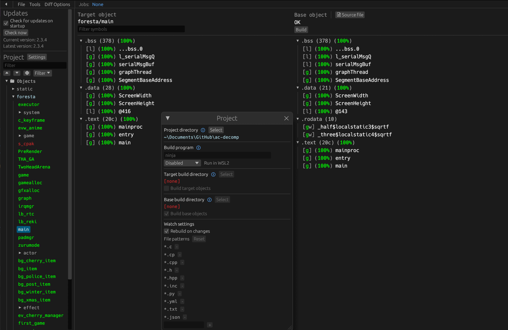

# Animal Crossing Decomposition & Metal Port

A hybrid project combining two efforts:
- **Decompilation**: Complete reverse-engineering of Animal Crossing (GameCube) into C
- **Metal Port**: Native implementation for macOS, iOS, and iPadOS using Metal graphics

[![Build Status]][actions] [![DOL Progress]][Progress] [![REL Progress]][Progress] [![Discord Badge]][discord]

[][Progress]

[Build Status]: https://github.com/Prakxo/ac-decomp/actions/workflows/build.yml/badge.svg
[actions]: https://github.com/Prakxo/ac-decomp/actions/workflows/build.yml
[Progress]: https://decomp.dev/ACreTeam/ac-decomp
[DOL Progress]: https://decomp.dev/ACReTeam/ac-decomp.svg?mode=shield&measure=code&category=dol&label=DOL
[REL Progress]: https://decomp.dev/ACReTeam/ac-decomp.svg?mode=shield&measure=code&category=modules&label=REL
[Discord Badge]: https://img.shields.io/discord/727908905392275526?color=%237289DA&logo=discord&logoColor=%23FFFFFF
[discord]: https://discord.gg/hKx3FJJgrV

---

## Project Overview

This repository contains two parallel efforts:

### 1. Decompilation (`src/`, `include/`, `config/`, `build.sh decomp`)

Complete reverse-engineering of Animal Crossing (GameCube, GAFE01_00 USA) back into C source code. The decompiled code compiles to a bit-for-bit match of the original binary.

- Progress tracked at [decomp.dev](https://decomp.dev/ACreTeam/ac-decomp)
- Work with Ghidra, decomp.me, and a custom build system
- Builds static DOL executable and REL dynamic modules

**Entry point:** `./build.sh decomp [full|dol|rel]`

### 2. Metal Port (`platform/`, `build.sh platform`)

A native port of the decompiled game to macOS, iOS, and iPadOS using Apple Metal. The decompiled C code is untouched; all hardware API calls (GX graphics, DVD disc access, PAD controller input, etc.) route through platform-specific shim implementations.

**Architecture:**
- 96% original decompiled C code (unmodified)
- 2.3% C++ platform shim layer
- Metal graphics engine instead of GameCube GX
- Physical controller input only (no touch)

**Entry point:** `./build.sh platform [macos|ios|ipados]`

---

## Which Part Am I Working On?

| Goal | Directory | Command |
|------|-----------|---------|
| Help with decompilation | `src/`, `include/`, `docs/` | `./build.sh decomp full` |
| Porting to Metal / Apple platform | `platform/` | `./build.sh platform macos` |
| Understand project organization | This section + sub-READMEs | See links below |

---

## Quick Navigation

### For Decompilation Contributors
- **[Decompilation Guide](./docs/DECOMP_GUIDE.md)** — Getting started with reverse-engineering
- **[Dumping Game Files](./docs/extract_game.md)** — Extract your disc
- **[Ghidra Setup](./docs/ghidra_setup.md)** — Set up analysis tools
- Progress tracker: [decomp.dev](https://decomp.dev/ACreTeam/ac-decomp)

### For Metal Port Contributors
- **[Metal Port README](./platform/README.md)** — Build and run on macOS/iOS/iPadOS
- **[Technical Reference](./platform/TECHNICAL_REFERENCE.md)** — Subsystem architecture details
- **[Porting Status](./platform/PORTING_STATUS.md)** — Current implementation progress

---

## Prerequisites

### For Decompilation

**All platforms:**
- Python 3.8+
- Ninja build tool
- The Metrowerks C compiler (downloaded automatically via build system)
- A copy of the game disc (ISO/GCM format)

On **macOS:**
```bash
brew install python ninja
brew install --cask --no-quarantine gcenx/wine/wine-crossover
```

On **Windows:**
- Python (add to PATH)
- Download [Ninja](https://github.com/ninja-build/ninja/releases) (add to PATH)
- Windows native tooling — WSL not required

On **Linux:**
- Python, Ninja from package manager
- For x86(_64): [wibo](https://github.com/decompals/wibo) auto-downloads
- For non-x86: Wine required

### For Metal Port

**macOS:**
```bash
brew install cmake sdl2
```

**iOS/iPadOS:**
- Xcode 14.0+

---

## Building

### 1. Clone & Set Up

```bash
git clone --recursive https://github.com/Prakxo/ac-decomp.git
cd ac-decomp
git submodule update --init --recursive
```

### 2. Extract Game Files

Copy your disc image to `orig/GAFE01_00/`:

- Supported formats: ISO, RVZ, WIA, WBFS, CISO, GCZ
- See [Dumping Game Files](./docs/extract_game.md) for extraction instructions

### 3. Build

**Decompilation:**
```bash
./build.sh decomp full          # Full build (DOL + REL)
./build.sh decomp dol           # DOL executable only
./build.sh decomp rel           # REL module only
```

**Metal Port:**
```bash
./build.sh platform macos       # macOS
./build.sh platform ios         # iOS
./build.sh platform ipados      # iPadOS
```

---

## Repository Structure

```
ac-decomp/
├── README.md                    # This file
├── build.sh                     # Build entry point
├── configure.py                 # Decompilation setup
│
├── src/                         # Decompiled game C source
├── include/                     # Decompiled C declarations + SDK headers
├── platform/                    # Metal port (macOS/iOS/iPadOS)
│   ├── README.md               # Platform-specific guide
│   ├── TECHNICAL_REFERENCE.md  # Deep dive into subsystems
│   ├── PORTING_STATUS.md       # Implementation progress
│   ├── src/                    # Platform-specific C/C++
│   ├── CMakeLists.txt          # Platform build config
│   └── toolchains/             # iOS cross-compilation
│
├── docs/                        # Decompilation documentation
│   ├── DECOMP_GUIDE.md         # Getting started
│   ├── Ghidra guides            # Analysis tool tutorials
│   ├── decomp.me basics         # Online matcher tool
│   └── doc_assets/             # Screenshots
│
├── tools/                       # Build system utilities
│   ├── project.py              # Build metadata
│   ├── ninja_syntax.py         # Ninja rules generator
│   └── converters/             # Asset converters
│
├── config/GAFE01_00/           # Decompilation metadata (USA version)
│   ├── config.yml              # Build configuration
│   ├── symbols.txt             # Function roster
│   └── splits.txt              # Module boundaries
│
└── build/                       # Generated build artifacts
    ├── GAFE01_00/              # Compiled DOL/REL
    └── tools/                  # Tool binaries
```

---

## Supported Versions

- `GAFE01_00` — Animal Crossing (USA), Rev 0 ✓ Decompilation complete, Metal port in progress

The N64 version is being worked on separately at [zeldaret/af](https://github.com/zeldaret/af).

---

## Diffing (Decompilation)

Once the initial decompilation build succeeds, an `objdiff.json` should exist in the project root.

Download the latest release from [encounter/objdiff](https://github.com/encounter/objdiff). Under project settings, set `Project directory`. The configuration should be loaded automatically.

Select an object from the left sidebar to begin diffing. Changes to the project will rebuild automatically: changes to source files, headers, `configure.py`, `splits.txt` or `symbols.txt`.



---

## How It Works

### Decompilation Build Flow

```
Game Disk → Extracted Binary → Ghidra Analysis → C Source
     ↓
Original C Source (matches bit-for-bit)
     ↓
Compile with Metrowerks → DOL + REL modules
     ↓
Diff against original → ✓ verification
```

### Metal Port Build Flow

```
Decompiled C Source → Platform shim layer (C++)
     ↓
Compile with Apple Clang + CMake
     ↓
Link with Metal, SDL2, system frameworks
     ↓
macOS .app / iOS .ipa
```

---

## Contributing

### Decompilation

1. Check [decomp.dev](https://decomp.dev/ACreTeam/ac-decomp) for tasks
2. Use Ghidra + decomp.me to understand and rewrite functions
3. Submit PR with your C implementation and reference assembly
4. Maintainers verify bit-for-bit match

### Metal Port

1. Check [PORTING_STATUS.md](./platform/PORTING_STATUS.md) for remaining work
2. Improve platform shim implementations (GX → Metal, PAD input, etc.)
3. Test on macOS, iOS, and iPadOS
4. Submit PR with testing notes

See [TECHNICAL_REFERENCE.md](./platform/TECHNICAL_REFERENCE.md) for architecture details.

---

## Known Issues & Limitations

- **Metal Port**: iOS builds run in local development only (JIT restriction for App Store)
- **Pointer sizes**: Original GameCube code is 32-bit PowerPC; porting to 64-bit arm64 requires careful auditing
- **Controller required**: No on-screen touch controls on iOS/iPadOS
- **Big-endian data**: All disc and save data must be byte-swapped for arm64

---

## Resources

- [decomp.dev](https://decomp.dev/ACreTeam/ac-decomp) — Decompilation progress tracker
- [decomp.me](https://decomp.me) — Online assembly-to-C matching tool
- [Ghidra](https://ghidra-sre.org/) — Reverse engineering framework
- [Dolphin Emulator](https://dolphin-emu.org/) — GameCube/Wii reference
- [Discord Community](https://discord.gg/hKx3FJJgrV) — Development chat

---

## Credits

- jamchamb, Cuyler36, NWPlayer123 and fraser125 for past documentation of Animal Crossing.
- encounter and NWPlayer123 for [dtk-template](https://github.com/encounter/dtk-template) and setting up the current build system.
- Metal port contributors and platform shim developers

See [LICENSE](./LICENSE)
