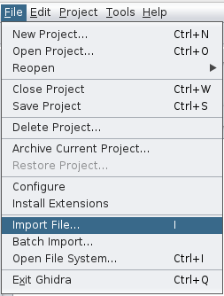
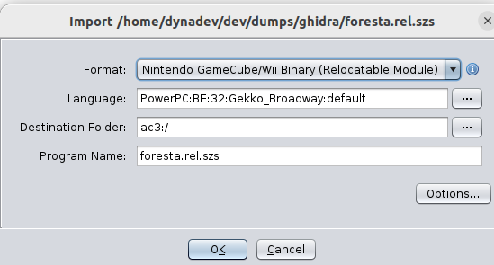
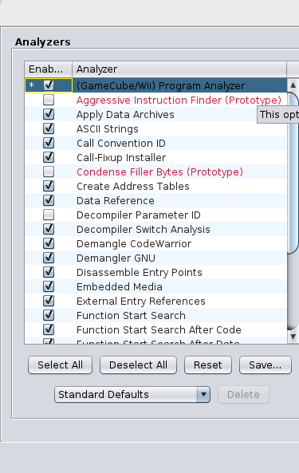
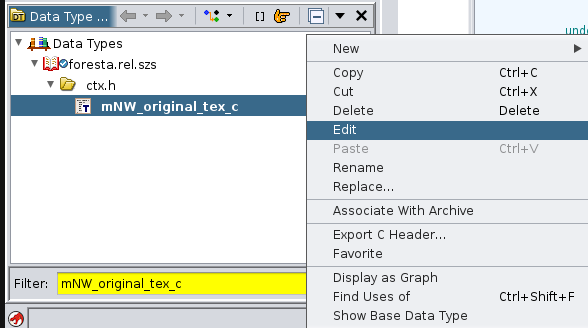
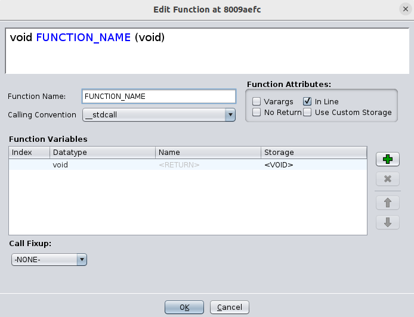

# Ghidra Setup
[Ghidra](https://github.com/NationalSecurityAgency/ghidra) is a cross-platform, open-source program that can be used to help reverse engineer compiled code. 

## Installing Ghidra
To install Ghidra, follow the [instruction on their project page](https://github.com/NationalSecurityAgency/ghidra?tab=readme-ov-file#install). This involves installing the listed requirements and downloading an archived release for your OS.

## Installing Ghidra GameCube Loader Plugin
To properly import and analyze the [game files you extracted](./extract_game.md) you will need to install the [Ghidra GameCube Loader Plugin](https://github.com/Cuyler36/Ghidra-GameCube-Loader).

Follow the steps below to install the plugin:
1. [Download an archived release](https://github.com/Cuyler36/Ghidra-GameCube-Loader/releases) of the plugin appropriate for the version of Ghidra you are using. Do not decompress the `.zip` file.
2. Navigate to the folder where Ghidra was installed.
3. Copy the plugin `.zip` file to `<Ghidra install directory>/Extensions/Ghidra/`
4. Start Ghidra.
5. Select `File->Install Extensions`.

6. Make sure the checkbox next to `GameCubeLoader` is checked.

7. Press "OK".

# Importing Binaries
With both Ghidra and the GameCube Loader plugin installed you can now import the binaries extracted from the game for analysis. To do so follow the steps below:
1. Create a new Ghidra Project.
2. Select `File->Import File`.

3. Select one of the binary files you extracted: `foresta.rel.szs` or `main.dol`.
4. In the Import dialog, make sure that `Nintendo GameCube/Wii Binary` is selected for the format. Click OK.

5. After import is complete, find the binary in the project view. Open it by double clicking it.
6. Upon opening the file, you will get a prompt to analyze the file. Select "Yes".
7. On the Analyzer window, make sure that the `(GameCube/Wii) Program Analyzer` is checked. Click OK.

8. Wait for the analyzer to finish running.

The analyzer will import symbols for some of the functions, structs, and data used in the game. These symbols make it easier to reverse engineer code by giving us hints as to what specific functions do and help us match our code closer to the original code.

## Importing Context
You can optionally import a [context file](generating_decomp_context.md) to help populate Ghidra with structs and typedefs used in our reverse-engineered C code. This allows us to redefine function signatures and retype variables.

1. [Generate your context file](./generating_decomp_context.md) or copy your context from an existing source such as a [decomp.me](https://decomp.me/) scratch.
2. Got to `File->Parse C Source`.

3. On the Parse C Source dialog, press the green "+" button in the "Source files to parse" section.

4. Select the context file you wish to import. Please note that it has to have the `.h` extension.
5. Press the "Parse to program" button at the bottom of the dialog.

### Special Modifications
> :warning: Due to Ghidra's C parser not properly parsing certain attributes, some additional modifications will need to be made.

#### Struct Aligments
The Ghidra C parser does not properly parse alignments specified by the `_Alignas()` keyword or the  `__attribute__((aligned()))` attribute. After importing your context, search for any uses of the `_Alignas()` or `__attribute__((aligned()))` and make note of the structs using them and the aligment values for each.

An example of a structure that would need to be fixed can be seen below:

~~~C
typedef struct original_texture_s {
  u8 data[(32 * (32 / 2))];
} __attribute__((aligned(32))) mNW_original_tex_c;
~~~

In the above case, `mNW_original_tex_c` is aligned to `32` bytes. However, when imported to Ghidra, it will have an alignment of `1`. To fix the alignment follow these steps:
1. Open your project in Ghidra.
2. Navigate to the "Data Tpe Manager".
3. Search for the struct you need to re-align.
4. Right-click on the struct name and select "Edit".

5. Near the bottom of the Struct Editor dialog, look for `align (minimum)`. Select the middle option to manually enter the alignment. Please note that this is in hexadecimal, so be sure to convert any number to hex first.

6. Hit the save button near the top of the dialog, or close the dialog and press "Yes" when prompted to save the changes to the struct.

Please note that if you re-import an entire context file any previous modifications to structs will be discarded. It is strongly recommended that after doing an initial import that you import any new functions and structs on a case-by-case basis. Otherwise, remember to re-apply the alignment changes.

## Inline Functions
While browsing through decompiled code in Ghidra you may come across calls to functions with names following a pattern of `Fun_XXXX`. The functions correspond to the built-in saved register functions and should be inlined and have a `void` return type in order to give a more correct decompilation. It is also recommended to change the name of the function to `FUNCTION_NAME` or another consistent name format to help you keep track of which functions you've made modifications to.

